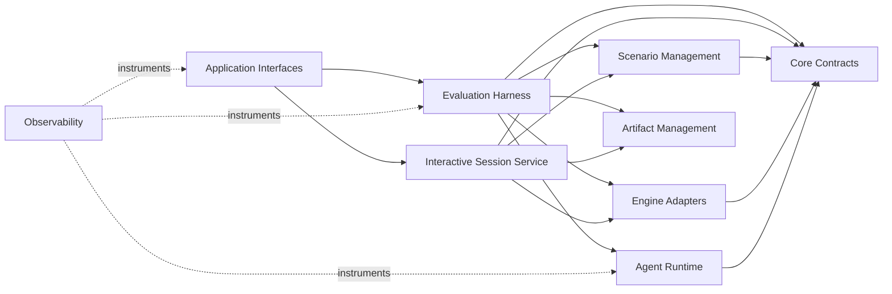

# Architecture Migration Inventory (M0)

**Status:** approved target architecture; no production-code migration has
started.  
**Purpose:** create a behaviour-preserving migration plan from the current
research-oriented layout to a production-quality LLM-agent evaluation
platform.

This is an inventory and decision record, not a proposal to move every file in
one change.  It supplements [REPO_SPLIT_DEPENDENCY_AUDIT.md](REPO_SPLIT_DEPENDENCY_AUDIT.md),
which records the website split specifically.  This document covers the whole
benchmark package and establishes the boundaries that must exist *before* any
physical repository split.

## 1. Target architecture

```text
OpenRA-Bench
|
|- Core Contracts
|- Scenario Management
|- Engine Adapters
|- Agent Runtime & Provider Adapters
|- Evaluation Harness
|- Artifact Management
|- Observability
|- Application Interfaces
`- Tests

Cross-cutting: runtime configuration and composition; CI; release and docs;
security and operations (required before public deployment).
```

The dependency direction is inward.  Contracts have no dependency on OpenRA,
FastAPI, provider SDKs, filesystem paths, or the web application.  Interfaces
(CLI, FastAPI, and future Web clients) use public application services rather
than importing an engine, YAML loader, or artifact-directory implementation.



## 2. Migration invariants

Every migration PR must preserve these rules.

1. **No big-bang directory move.** Add a new implementation and migrate one
   caller chain at a time.  Old paths temporarily re-export the new symbol.
2. **No scenario semantics change.** The no-defect/no-cheat bar in `CLAUDE.md`
   remains binding.  A structural refactor never changes a scenario's win,
   loss, map, timing, seed, or engine interpretation.
3. **Existing artifacts remain readable.** `result/` and playback readers must
   continue to support the documented v1 on-disk layout in
   `docs/result_schema.md`.
4. **A public API is intentional.** `PACKS_DIR`, direct YAML paths,
   `_scenario_to_tmp_yaml`, and mutable engine internals are not new public
   APIs.  Existing consumers receive a time-bounded compatibility facade.
5. **Contracts are engine-independent.** Engine-specific fields stay in an
   adapter payload or an explicitly versioned extension, not in every domain
   object.
6. **Tests migrate with ownership.** Tests are not merely relocated at the
   end; each newly extracted boundary gains contract and integration coverage.

## 3. Baseline to preserve before M1

M0 is complete only after the following reference behaviour is recorded and
available to compare against later refactors.

| Surface | Reference evidence | Why it is load-bearing |
|---|---|---|
| Scenario quality | `pytest tests/` and `tools/validate_pack_bar.py` | Proves intended policies can win and shortcut/stall policies lose. |
| Episode execution | A fixed compiled pack, scripted controller, seed, and expected `EpisodeResult` | Detects engine-adapter or harness drift. |
| Model evaluation | One saved `run_eval` episode including playback | Preserves provider/tool/action and artifact behaviour. |
| Interactive play | Existing FastAPI manual-review integration tests | Preserves browser-session lifecycle and save/discard semantics. |
| Artifact readers | Existing v1 playback/result fixtures and readers | Preserves reproducibility and existing analyses. |

No live-model call is required in ordinary CI.  Fixed scripted or mocked
provider responses are the deterministic migration baseline.

## 4. Current-to-target inventory

Priority: **P0** means establish a boundary early; **P1** means migrate after
its dependencies are stable; **P2** means leave in place until an owning
consumer is migrated.  Risk describes migration risk, not code quality.

### 4.1 Core package

| Current file | Current responsibility / notable dependencies | Target module | Priority | Risk and migration notes |
|---|---|---|---|---|
| `__init__.py` | package marker; no current domain implementation | Package composition | P2 | Keep minimal. It must not become a convenience import that eagerly imports engine/provider/UI dependencies. |
| `scenarios/schema.py` | Pydantic pack/level models; imports legacy training `ScenarioDefinition` and win conditions | Core Contracts + Scenario Management | P0 | High: source of scenario truth. Introduce `ScenarioRef`/`CompiledScenario` facade first; do not duplicate YAML semantics. |
| `scenarios/loader.py` | `PACKS_DIR`, YAML load, level compile, map resolution | Scenario Management | P0 | High: tests and scripts import `PACKS_DIR`/`compile_level` directly. Preserve re-exports during migration. |
| `scenarios/validate.py` | CLI validation over loader/compiler | Scenario Management + Interfaces/CLI | P1 | Split validation service from thin CLI wrapper. |
| `scenarios/win_conditions.py` | predicate grammar and evaluation | Scenario Management | P0 | High: scenario semantics; preserve public predicate grammar and translations contract. |
| `scenarios/__init__.py` | current public convenience exports | Application public facade | P1 | Keep as compatibility facade until `openra_bench.api` is adopted. |
| `mapgen.py` | map generation/materialisation and map asset access | Scenario Management | P1 | Medium: mixes asset IO and generation; keep deterministic materialisation. |
| `botgen.py` | scripted opponent definitions/validation | Scenario Management | P1 | Medium: scenario compilation dependency; do not place under model agents. |
| `rust_adapter.py` | Rust observation -> Python render/signals conversion | Engine Adapters | P0 | High: adapter output is consumed by harness, UI, and playback. Add contract snapshots before moving. |
| `eval_core.py` | `run_episode`, `run_level`, engine pool, temporary engine YAML, goal tracking, playback writes | Engine Adapters + Evaluation Harness | P0 boundary, P1 implementation | Very high: cross-layer hub. Extract engine session/YAML encoding first, then harness; retain `run_level` compatibility wrapper. |
| `goal_tracker.py` | per-turn predicate progress and reward vector | Evaluation Harness | P1 | Medium: depends on scenario predicates; result/trace contract needs stable fields. |
| `scoring.py` | scorecard calculation; imports `EpisodeResult` and reward weights | Evaluation Harness | P1 | Medium: migrate only after `EpisodeResult` has a contract facade. |
| `adversarial.py` | adversarial evaluation utilities | Evaluation Harness | P2 | Scope only after standard episode API is stable. |
| `one_v_one.py` | head-to-head run orchestration | Evaluation Harness | P2 | Medium/high concurrency and adapter coupling. Treat as a specialised harness consumer. |
| `pairwise.py` | pairwise evaluation orchestration; imports `run_eval.evaluate` | Evaluation Harness | P2 | Current reverse dependency on CLI-oriented module must be removed after `run_evaluation` service exists. |
| `run_eval.py` | CLI args, sweep orchestration, aggregation, provider setup, journal/playback/score writes | Evaluation Harness + Artifact Management + Interfaces/CLI | P1 | Very high: split incrementally into evaluation service, result reporter, and a thin CLI. Never move wholesale. |
| `leaderboard.py` | ingest/result tables and capability breakdown | Evaluation reporting consumer | P2 | Preserve legacy CSV/result readers; later consume `RunResult` plus artifact query API. |
| `battle_viewer.py` | playback browsing view-model | Application Interfaces / reporting consumer | P2 | Depends on playback reader; moves with UI decision, not core contracts. |
| `playback.py` | episode directory, turns/messages/manifest/minimap writes | Artifact Management | P0 | High: current v1 artifact writer. Extract `ArtifactStore` behind it while retaining exact output. |
| `full_playback.py` | full JSONL trajectory and PNG sidecars; partial-file recovery | Artifact Management | P1 | High: resume correctness and atomic finalisation are load-bearing. |
| `playback_view.py` | playback readers/rendering helpers | Artifact Management + Application Interfaces | P1 | Split read-model from Streamlit/UI rendering when consumers migrate. |
| `resilience.py` | provider retry taxonomy, rate limiting, append-only run journal | Agent Runtime + Artifact Management | P1 | Medium/high: separate retry policy from journal persistence without changing resume keys. |
| `agent.py` | model agent, tool schemas, tool-call conversion, agent history | Agent Runtime & Provider Adapters | P0 | High: structured tool behaviour and transcript shape must remain stable. |
| `providers.py` | provider configs, OpenAI-compatible and Bedrock clients | Agent Runtime & Provider Adapters | P1 | Medium: no import from harness or FastAPI; preserve provider selection behaviour. |
| `prompt_v2.py` | system/user briefing construction, multimodal prompt handling | Agent Runtime & Provider Adapters | P1 | Medium: prompt changes are behaviour changes; use golden prompt fixtures. |
| `game_knowledge.py` | objective wording and game knowledge | Agent Runtime & Provider Adapters | P1 | Medium: also used by catalog generation; expose an explicit presentation API. |
| `controller.py` | controller protocol and command/action objects | Core Contracts + Agent Runtime | P0 | High: bridge between agent policy and engine command. Establish `AgentAction` facade before relocation. |
| `handoff.py` | handoff controllers and trajectory logic | Agent Runtime | P2 | Depends on controller/introspection; migrate after controller contract. |
| `human_labeling.py` | `InteractiveSession`, human actions, review/save/discard | Application Interfaces / Interactive Session Service | P1 | Very high: shares engine and playback but has distinct lifecycle. Do not force it through automated `EvaluationRun`. |
| `human_study.py` | study assignment/queue logic | Application Interfaces / Interactive Session Service | P2 | Medium: depends on human session workflow. |
| `playlist.py` | playlist selection utilities | Application Interfaces / Interactive Session Service | P2 | Low/medium: verify active ownership; legacy UI references exist. |
| `minimap.py` | map/minimap rendering | Engine Adapters + presentation support | P1 | Medium: rendering uses engine/map assets; expose image bytes/metadata, not UI response objects. |
| `structured_fog.py` | structured fog observation formatting | Engine Adapters | P1 | Medium: formalise as an `Observation` modality. |
| `_vendor/*` | vendored prompt/briefing/minimap helpers/assets | Internal implementation | P2 | Do not move until licences, provenance, and public replacement boundary are documented. |

### 4.2 Vendored runtime and external engine boundary

These are material runtime dependencies even though they are not ordinary
`openra_bench` domain modules.  They must be inventoried explicitly so an
internal package rearrangement does not accidentally turn an implementation
assumption into an unsupported public dependency.

| Current path / dependency | Current responsibility / notable dependencies | Target ownership | Priority | Risk and migration notes |
|---|---|---|---|---|
| `openra_rl_training/__init__.py` | vendored package marker and provenance note | Legacy runtime compatibility | P1 | Keep minimal and documented; it is not a future public benchmark API. |
| `openra_rl_training/scenario.py` | legacy `ScenarioDefinition` model consumed by `scenarios/schema.py` | Legacy runtime compatibility | P0 | High: scenario schema currently imports it directly. Introduce an explicit conversion boundary before replacing or extracting it. |
| `openra_rl_training/training/rust_env_pool.py` | lifecycle wrapper around native `openra_train.OpenRAEnv` and `Command` | Engine Adapters | P0 | Very high: canonical native-engine boundary. Move its *benchmark-facing protocol* behind Engine Adapters; do not duplicate engine lifecycle semantics. |
| `openra_rl_training/training/reward_funcs.py` | default reward weights used by `scoring.py` | Evaluation Harness | P1 | Medium: re-export/version weights explicitly before moving scoring; changing defaults changes benchmark scores. |
| `openra_rl_training/training/minimap_renderer.py` | native-observation minimap renderer used by `minimap.py` | Engine Adapters / presentation support | P1 | Medium: preserve visual output contract for thumbnails and playback. |
| `openra_rl_training/training/__init__.py` | vendored training package marker | Legacy runtime compatibility | P2 | No functional migration until imports have moved. |
| installed `openra_train` wheel | PyO3 Python bindings: `OpenRAEnv`, `Command`, native engine execution | External engine contract | P0 | Very high: benchmark must target a pinned, tested engine API. Treat native types as adapter-private. |
| `yxc20089/OpenRA-Rust` repository | separately owned Rust engine, bindings, embedded RA rules/weapons data | External engine dependency | P0 | Not a directory in a normal bench checkout and not a module to relocate here. CI clones/builds it separately; changes require an engine-repo change, wheel rebuild, and affected scenario revalidation. |
| OpenRA-Rust embedded RA YAML snapshot | authoritative unit/weapon/map-rule data included in the engine wheel | External engine data dependency | P0 | Never copy this data into benchmark contracts. Record engine revision/version in future run manifests and releases. |

**Boundary rule:** `openra_bench` code outside Engine Adapters must not require
`openra_train.Command`, `OpenRAEnv`, or an OpenRA-Rust checkout in its public
types.  Only the adapter translates those native types to/from benchmark
contracts.  The wheel build and engine revision remain CI/release concerns.

### 4.3 Interfaces, scripts, and repository assets

| Current path | Current responsibility / dependencies | Target module | Priority | Risk and migration notes |
|---|---|---|---|---|
| `site/game_api.py` | FastAPI routes, process-local session dictionary, state serialisation, direct `InteractiveSession`/minimap/scenario access | Application Interfaces / API | P1 | Very high: API directly accesses internal session/adapter state. Replace with session-service DTOs, preserving routes until a versioned API exists. |
| `site/index.html` | static browser mission player | Application Interfaces / Web | P2 | Medium: migrate only after API/catalog contracts are stable. |
| `site/generate.py` | static catalog + thumbnail generator; directly uses scenario/engine internals | Application Interfaces / build tooling | P2 | High: extract a benchmark catalog export service before repo split. |
| `site/public/scenarios.json` | generated scenario catalog | Generated artifact | P1 | Do not hand-edit; version its schema and generation provenance. |
| `app.py` | Gradio leaderboard/catalog/battle viewer | Application Interfaces / Web | P2 | Medium: second web surface; decide retain/retire/migrate only after reporting API exists. |
| `evaluate.py`, `evaluate_runner.py` | legacy top-level evaluation entry points | Application Interfaces / CLI | P2 | Low/medium: replace with package console scripts only after parity tests. |
| `scripts/audit_scenarios.py` | scenario audit runner using loader + `run_level` | Application Interfaces / maintainer CLI | P2 | Medium: migrate to public scenario/evaluation API. |
| `scripts/collect_eval_data.py` | sweep execution/resume collection | Application Interfaces / maintainer CLI | P2 | Medium/high: consumes journal/full playback paths; wait for artifact facade. |
| `scripts/{triage.py,triage_phase4.py,coverage_map.py}` | analysis over packs/results | Reporting tools | P2 | Medium: introduce read-only catalog/result query API. |
| `scripts/{gen_scenario_docs.py,author_perscenario_maps.py,build_scout_arena_map.py}` | documentation/map authoring utilities | Scenario Management tooling | P2 | Low/medium: retain as tools until authoring API is proven. |
| `scripts/{view_playback.py,view_1v1_playback.py}` | Streamlit playback inspection | Application Interfaces / reporting | P2 | Low: consumers of playback read model. |
| `openra_bench/scenarios/packs/*.yaml` | scenario source of truth | Scenario Management data | P0 | Very high: never relocate/mutate in structural PRs; package as versioned data later. |
| `data/maps/*.oramap` and map assets | engine/map source assets | Scenario Management data | P0 | High: paths and map resolution are externally observable behaviour. |
| `data/results.csv`, `result/`, `playback/`, `data/runs/` | legacy results and generated run artifacts | Artifact Management data | P0 | High: retain v1 read compatibility; define retention/version policy before changing layout. |
| `.github/workflows/test.yml` | engine build, tests, no-cheat CI gate | Tests / CI | P0 | High: must remain green through all migrations; add new contract tests incrementally. |
| `.github/workflows/sync-to-hf.yml` | Gradio/HF deployment | Delivery / Web | P2 | Medium: moves only when web ownership/deployment is decided. |
| `README.md`, `docs/result_schema.md`, `docs/IMPLEMENTATION_NOTES.md` | public usage and artifact/web docs | Documentation | P1 | Medium: update contracts/docs atomically with public interface changes. |

### 4.4 Test ownership migration

| Current test group | Target ownership | Migration rule |
|---|---|---|
| `tests/test_*scenario*.py` and per-pack tests | Scenario Management + Engine Adapter integration | Keep current pack-specific no-cheat/solvency assertions; do not replace them with shallow schema checks. |
| `tests/test_rust_integration.py`, engine-facing scenario tests | Engine Adapters | Add adapter contract snapshots around observation/action conversion. |
| `tests/test_agent.py`, `test_controller.py`, `test_resilience.py` | Agent Runtime | Add mocked-provider and golden tool/action tests before moving code. |
| `tests/test_playback.py`, `test_playback_completeness.py`, result-schema tests | Artifact Management | Assert old artifacts remain readable and manifest versions are explicit. |
| `tests/test_run_eval.py`, `test_integ_pipeline.py`, pairwise/1v1 tests | Evaluation Harness | Add a deterministic end-to-end `run_episode` contract test. |
| `tests/test_manual_review_flow.py`, `test_game_api_*.py`, `test_site*.py`, `test_app.py` | Application Interfaces | Keep API route compatibility until a versioned replacement is intentionally released. |
| `.github/workflows/test.yml` | CI | Preserve full engine build, test suite, and no-cheat validator as non-negotiable gates. |

## 5. Known boundary violations to remove

These are migration targets, not defects to fix opportunistically in M0.

| Violation | Evidence | Target state | Earliest safe phase |
|---|---|---|---|
| Harness owns engine bootstrapping and temporary YAML encoding | `eval_core.py` imports `RustEnvPool`, `RustObsAdapter`, YAML/tempfile | `EngineSession`/scenario encoder behind Engine Adapter; harness consumes adapter protocol | M2 |
| Harness and CLI write artifacts directly | `eval_core.py`, `run_eval.py` write progress, score, journal/playback paths | `ArtifactStore` owns paths, atomic writes, manifest, and v1 compatibility | M4 |
| API serialises private session/adapter state | `site/game_api.py` reads `sess._adapter`, `sess.compiled`, `_sessions` | Session service returns versioned state DTOs; API never accesses private internals | M5 |
| Website generator boots engine and reads internals | `site/generate.py` depends on eval core/adapter/minimap | benchmark-owned catalog/thumbnail export service | M5 |
| Pairwise depends on CLI-oriented evaluation module | `pairwise.py -> run_eval.evaluate` | both consume an application-level `run_evaluation` service | M4 |
| Resilience combines provider policy and journal file persistence | `resilience.py` | provider retry/rate limit in Agent Runtime; journal in Artifact Management | M4 |
| Tests/scripts use internal paths and helpers | imports of `PACKS_DIR`, `_scenario_to_tmp_yaml`, `RustEnvPool` | supported test fixtures/public facades; compatibility re-exports during transition | M1-M4 |

## 6. Ordered implementation plan

### M0 — Inventory and characterisation (this document)

No runtime code moves. Record representative baseline outputs and add only
documentation or non-behavioural test fixtures.

### M1 — Contracts and public facade

Add contracts and `openra_bench.api` alongside the old implementation. Provide
stable read/execute entry points, errors, and version metadata. Do not remove
old imports.

**Exit criteria:** a public contract test can load/compile a scenario and run a
deterministic episode without exposing engine objects.

### M2 — Scenario Management and Engine Adapters

Move implementation behind the M1 facade. First isolate scenario loading and
engine session/YAML encoding; retain `scenarios.loader` and `eval_core` aliases
for existing tests.

**Exit criteria:** existing scenario and engine integration suites pass without
semantic/artifact changes.

### M3 — Agent Runtime and Provider Adapters

Extract providers, prompts, tool conversion, controllers, and retry policy.
Use mocked-provider/golden fixtures to preserve tool-call actions.

**Exit criteria:** a fixed provider response produces the same validated action
and episode outcome through old and new entry points.

### M4 — Evaluation, Artifacts, and Observability

Introduce `ArtifactStore`, v1-compatible `ArtifactManifest`, typed trace events,
and a service-level `run_evaluation`. Then migrate multi-seed aggregation,
regression, scores, journal, playback, pairwise, and 1v1 callers.

**Exit criteria:** every new episode has a manifest and trace; previous v1
playbacks remain readable; cancellation/failure types are explicit.

### M5 — Interfaces, release, and optional repository split

Make CLI/FastAPI/human session/catalog/website consumers depend only on the
public package/application API. Introduce asynchronous evaluation-run lifecycle
and OpenAPI contract tests. Only then split the website repository and deploy.

**Exit criteria:** web code has no import of benchmark internals; it consumes
published package/API/artifact contracts; benchmark CI is independent of web
deployment CI.

## 7. Compatibility and removal policy

Each moved symbol follows this lifecycle:

```text
new canonical module
  -> old module re-export with deprecation note
  -> repository callers migrated
  -> external migration note/release window
  -> old export removed in a major version
```

No deprecation removes a path until repository callers, documented workflows,
and designated artifact readers are migrated.  Deprecated internal names used
only by tests may remain as test adapters during the refactor, but must be
listed explicitly rather than silently becoming public API.

## 8. M0 completion checklist

- [x] Target modules and dependency direction are defined.
- [x] Current source, interface, generated-data, and test ownership are mapped.
- [x] Cross-layer hubs and boundary violations are identified.
- [x] Migration order, compatibility policy, risks, and exit criteria are recorded.
- [ ] Deterministic baseline fixtures/results are selected and recorded before M1 code starts.
- [ ] M1 contract field definitions and semantic-version policy are approved.
